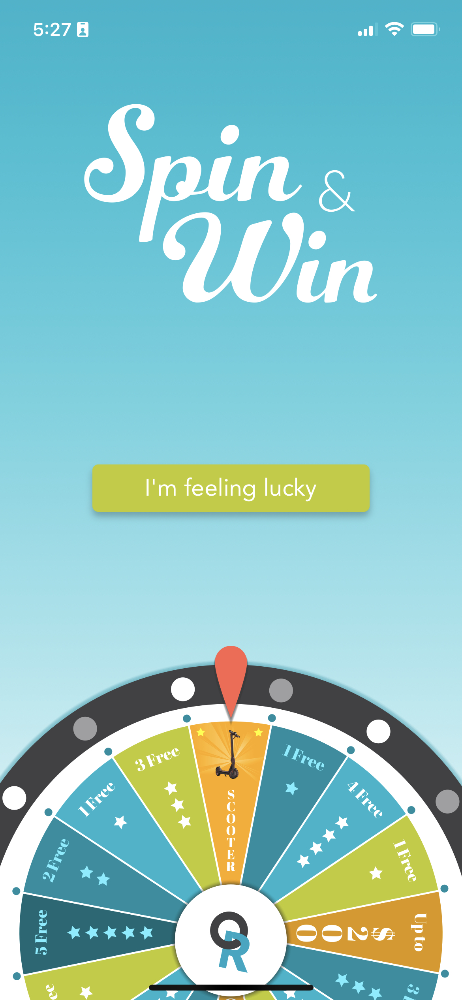

# SpinAndWin

A standalone spin and win component, spin and see what you win!

- A POST request is made to:

`{base_url}/redemptions?include=prize`

- The component expects a response in the format:
```
{
  "data": {
    "type": "redemptions",
    "id": "1",
    "attributes": {
      "customer_id": "1"
    },
    "relationships": {
      "prize": {
        "data": {
          "type": "prizes",
          "id": "1"
        }
      }
    }
  },
  "included": [{
    "type": "prizes",
    "id": "1",
    "attributes": {
      "category": "a scooter"
    }
  }]
}
```

Two schemes are provided, the production scheme expects you to provide your own endpoint. 
The stubs scheme will make a request to the provided stub json


